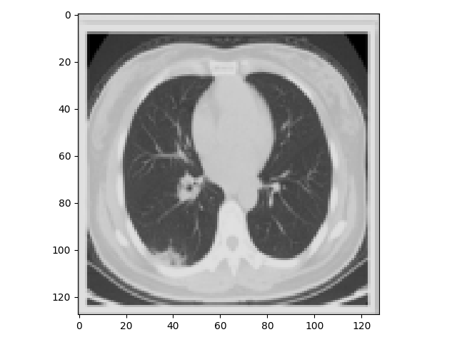
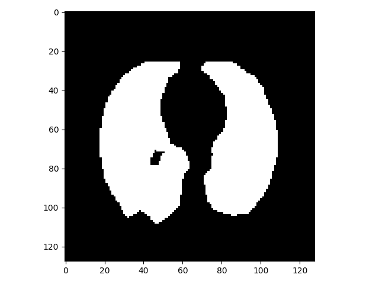
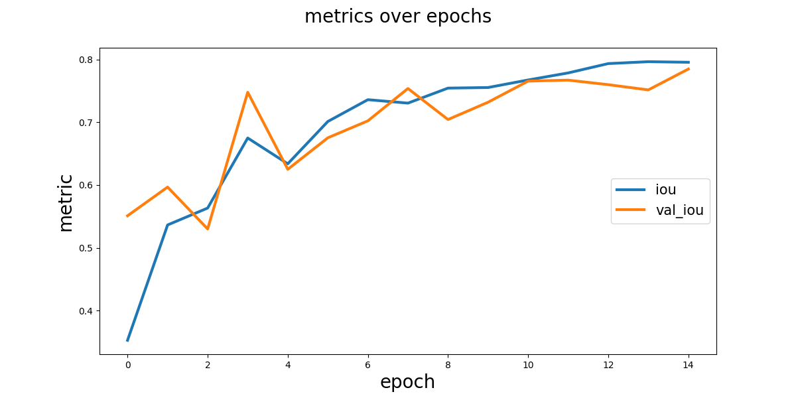
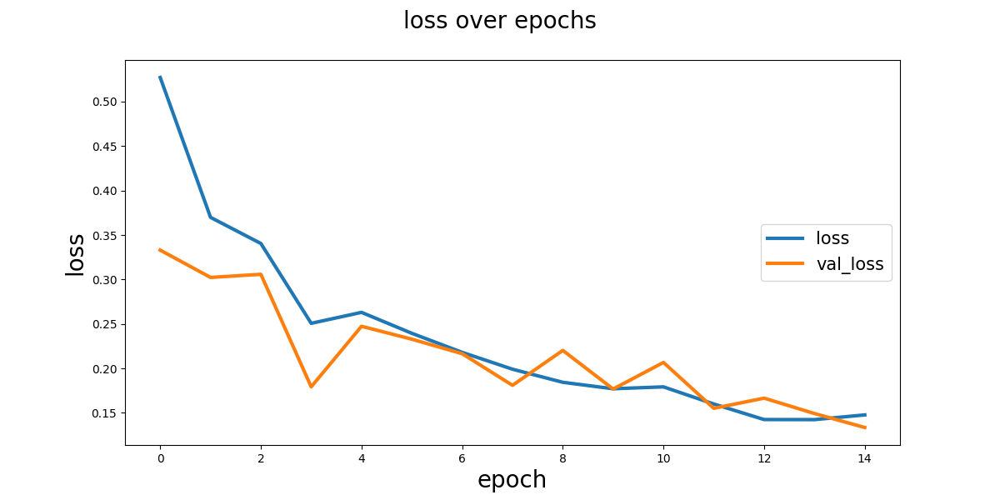
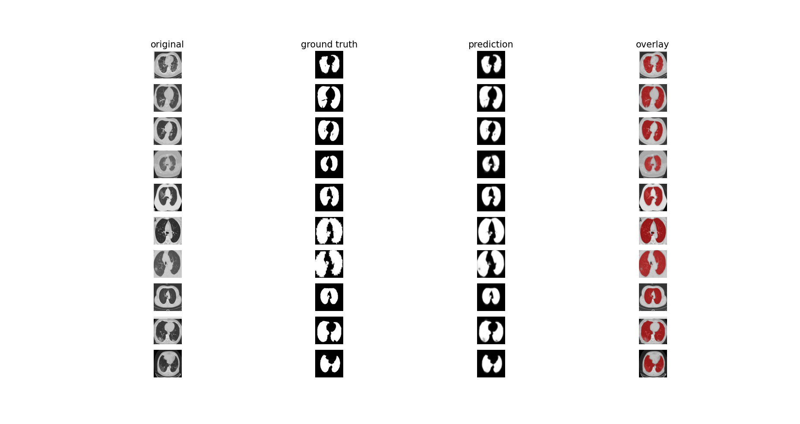
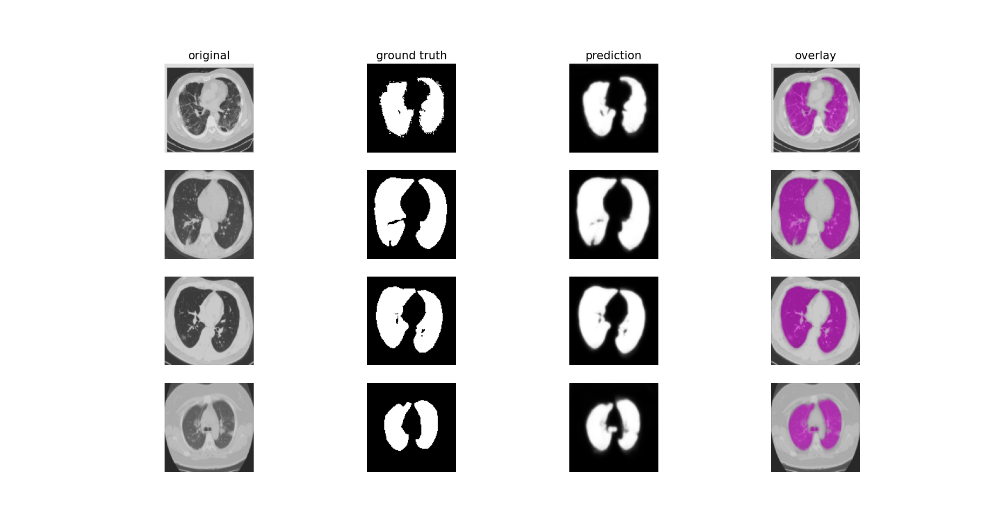

# keras-UNet-demo


## About
U-Net is a powerful convolutional neural network that was developed for biomedical image segmentation. 
The predictions are very good for segmentation, although there are some mistakes I have made with the test image masks.
U-Net demo implementation in Keras for working with image segmentation tasks. 

## Features: 

- U-Net models implemented in Keras
- masks and images plotted with overlay
- training loss/epoch plotted 
- json files used to draw mask
- data augmentation used to reduce loss

## ..
- labelme to get masks point: https://github.com/wkentaro/labelme
- utils to see model features : https://github.com/karolzak/keras-unet/blob/master/keras_unet/utils.py

### Receive files in numerical order
```python
def last_4chars(x):
    return(x[-7:])

file_list = os.listdir("test/jsons") #example

for j, filename in enumerate(sorted(file_list, key = last_4chars)):
```

### Masking with json data
```python
f = open('test/jsons/'+filename,)
data = json.load(f)
points = data['shapes']['points']
cv2.fillPoly(mask, [points], color=(255))

```
Input example:  


  

### U-Net 

```python
from model import unet

model = unet()
```


### Plot training history 

```python
history = model.fit_generator(...)

from utils import plot_segm_history

plot_segm_history(
    history, # required - keras training history object
    metrics=['iou', 'val_iou'], # optional - metrics names to plot
    losses=['loss', 'val_loss']) # optional - loss names to plot
```

Output:    




<br>

### Plot images and segmentation masks

```python
from utils import plot_imgs

plot_imgs(org_imgs=X_test,  # required - original images
          mask_imgs=Y_test, # required -  ground truth masks
          pred_imgs=y_pred, # predicted masks
          nm_img_to_plot=4) # number of images to plot

```

Output:
```python
(...,nm_img_to_plot=10) # number of images to plot
```

```python
(...,nm_img_to_plot=4) # number of images to plot
```


<br>


